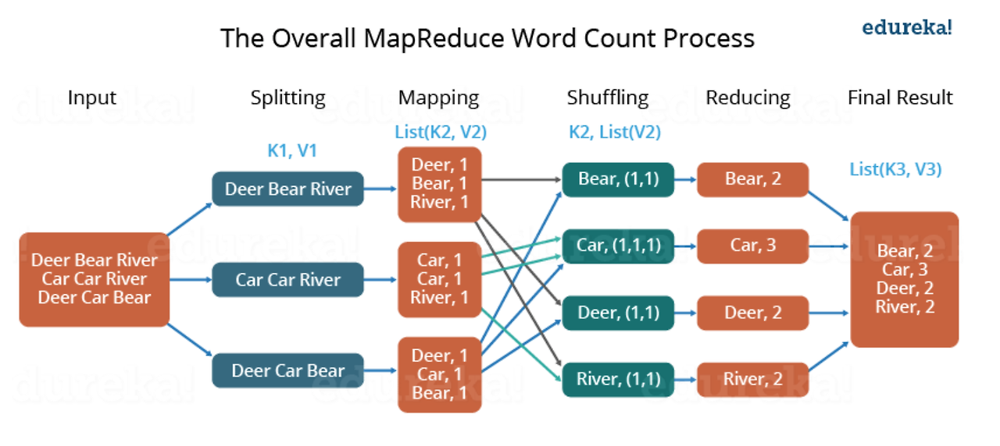
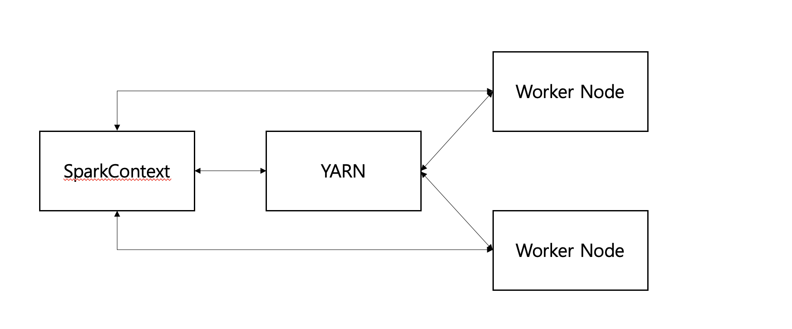

### Apache Hadoop
Apache Hadoop은 클러스터에서 데이터를 저장하고 처리하는 프레임워크다.  
데이터를 저장하는 HDFS과 데이터를 처리하는 MapReduce가 있다.  
YARN 프로젝트는 하둡 환경에서 MapReduce 뿐만아니라 다른 프레임워크도 운용할 수 있도록 지원해주기 위해 등장했다. YARN은 리소스 관리 역할을하며 HDFS과 MapReduce 중간에 위치힌다.  
  
MapReduce의 작업은 문제를 작은 단위로 나누고 처리하는 Map과 결과를 합치는 Reduce로 나뉜다.  

MapReduce는 이러한 처리과정에서 많은 입/출력 IO가 발생한다. 예를 들어, 데이터 처리과정에서 내부 자료 구조가 데이터로 가득찼을 경우 디스크 쓰기가 발생한다.  
또 여러 맵리듀스 작업이 있다고 가정하면 앞에 맵리듀스 작업이 끝나면 디스크에 쓰고, 다음 맵리듀에서는 해당 데이터를 디스크를 읽음으로써 많은 I/O가 발생한다.  

### Apache Spark
Apache Spark는 MapReduce와 동일하게 분산 데이터 처리 프레임워크다.  
MapReduce는 연산 과정에서 디스크에 쓰고 읽는 시간이 있다면 Spark는 메모리 내에서 데이터를 처리하기 때문에 MapReduce보다 훨씬 빠르다.  
Spark는 여러 라이브러리를 제공한다.  
| 라이브러리 | 설명 |
| :-----: | :------: |
| 스파크SQL | SQL 구문 또는 DataFrame API 지원 |
| 스파크 Streaming | 스트리밍 데이터 처리 지원 |
| 스파크 MLlib | 머신러닝 애플리케이션 개발 지원 |
| 스파크 GraphX | 그래프 처리와 그래프 알고리즘 지원 |
  

모든 분산 처리 애플리케이션은 일반적으로 실행을 제어하는 드라이버 프로그램과 하나 이상의 워커 노드와 함게 동작하는 구조다.  
스파크 애플리케이션의 경우 SparkContext객체가 드라이버 역할이다. SparkContext를 통해 클러스터 관리자(Mesos, Yarn)과 통신한다.  

